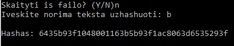
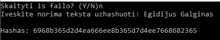

# Hash Funkcija
 Ši programa užhašuoja duotą tekstą (galima tekstą paduoti per konsolę, įrašyti ranka arba skaityti iš failo). Programa yra daryta pagal SHA-1 hash funkcija. Panaudojamos XOR, AND, OR, NOT funkcijos ant bitų eilučių.  
////  
The program hashes the input (can be given by console, on-runtime or read from file).  
The program is inspired by SHA-1 hash function.  
////   
  
- Maišos funkcijos veikimas: (Hash function pseudo-code)  
  `begin`   
    `input ID[5] // 5x 32 bit FIXED binary codes`  
    `input fraze`  
    `fraze -> bits`  
    `fraze filled up to mod 512 bits with '0' `  
    `XOR Step-loop function to create 80 words (32 bit lines)`  
    `Left shifting the words (transfering first symbol into the end)`   
    `modifying ID with 80 words using AND, OR and NOT functions`  
    `For every i < 5 {  
    `   IF ID[i][0] is '0' turn it into '1'
    ` }  `
    `turning ID -> hex`  
    `output ID`  
  `end`
  
# Photos
  
  
24 sutapimai (24 matches)  
  
  
  
28 sutapimai (28 matches)  
  
  
  
4 sutapimai (4 matches)  
  
  

  
Konstitucija.txt failą debug mode užhashino per 3,4 s  
  
  
20000 10 
length 20000 
100 length 
20000 500 length 
20000 1000 length  
  

# CHANGELOG
- V0.1: Sukurtas Hashavimas, inputas/outputas. Padarytas hashavimo testavimas. Uzhashintas konstitucija.txt failas bei 80000 eiluciu tikrinimui.
- V0.1.1 Buvo rasta klaida: kai kurios frazės hashai turėjo per mažai simbolių. Dabar bitų lygmenyje galutinis atsakymas turės '1' kaip pirmą bitą. (anksčiau galėjo būti 0)
